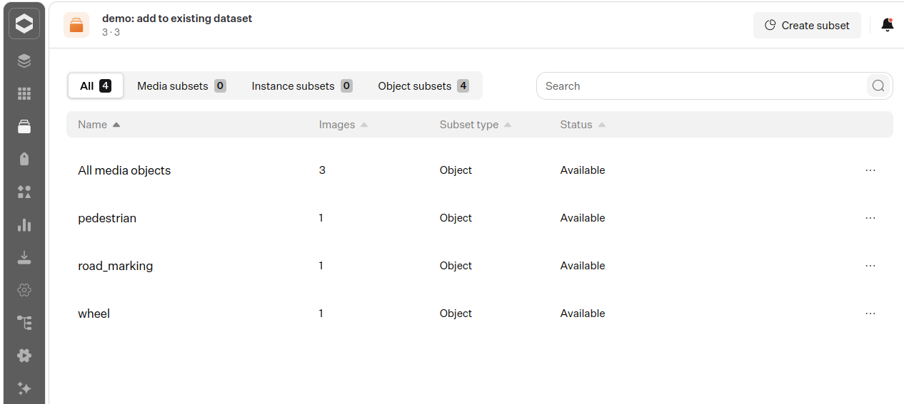

# Upload new data to an existing dataset

The script `upload_new_data_to_existing_dataset.py` demonstrates how to upload new data to an existing dataset that was previously created using the `quickstart.py` script.

> :warning: <b>Disclaimer: In most cases it makes more sense to upload your data as a new dataset.</b>

Note: The script was written with hari_client version 2.0.3.

Things that are implemented in the script:

- add one new media
- add one new media object
- make sure that you're not uploading duplicate data
  - based on the provided back references on the new media and media object
- make sure that you're reusing already existing `initial_attributes` correctly
  - by reusing the existing attribute ids and attribute types
- creates a new media subset and a new media object subset with the new data, so that the new data can be easily identified in HARI
- adds the new media object to the existing `All media objects` subset

## What to change for your own dataset

The script is meant as a demonstration, not as a ready to use utility, because in its current form it's only directly compatible with a dataset that was created following the `quickstart.py` example script.

In order to make it compatible for your own dataset and needs you have to consider the following details and adjust the script accordingly:

- Which subsets already exists that should contain the new data I want to add?
  - If there are, I have to find their subset ids and add them to the new medias and or media objects.
- Am I adding attributes with names which already exist in the dataset?
  - If yes, I should reuse the existing attribute ids for attributes that have the same name.

## How to run the script for the example case

1. Working Directory: `cd docs/example_code/upload_new_data_to_existing_dataset`
1. Create a `.env` filein the working directory. See `../.env_example`
1. Open the script `upload_new_data_to_existing_dataset.py` and change the `dataset_id` variable to be the id of your existing dataset.

   - The script verifies that the dataset_id can be found in HARI before doing anything else.

1. Run with: `python upload_new_data_to_existing_dataset.py`

## State before and after the new data is added

The differences you should see after the `upload_new_data_to_existing_dataset.py` script is run are:

- the dataset now contains three new subsets:
  - one for the new media: `my_new_medias_subset`
  - one for the new media_object: `my_new_media_objects_subset`
  - one for the new media_object object_category: `my_new_object_category`
- there's one new media
- there's one new media object

### Subset View

Before

After

